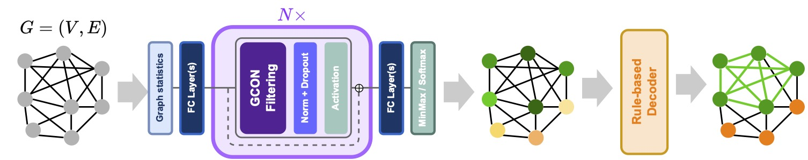

# Towards a GNN Framework for Combinatorial Optimization Problems

### [Frederik Wenkel*](https://wenkelf.github.io/), [Semih Cantürk*](https://semihcanturk.github.io/), [Stefan Horoi](https://shoroi.github.io/), [Michael Perlmutter](https://sites.google.com/view/perlmutma/home), [Guy Wolf](https://guywolf.org/)

_Accepted as Spotlight at Learning on Graphs (LoG) 2024_

[](https://arxiv.org/abs/2405.20543)



## Installation

```
conda create -n copt python=3.10
conda activate copt

conda install pytorch torchvision torchaudio pytorch-cuda=11.8 -c pytorch -c nvidia -y
conda install pyg -c pyg
conda install pytorch-scatter pytorch-sparse pytorch-cluster pytorch-spline-conv -c pyg
# might need to install latest torch-sparse via pip instead
pip install git+https://github.com/rusty1s/pytorch_sparse.git
conda install lightning -c conda-forge
pip install yacs einops loguru dwave-networkx ogb performer-pytorch wandb
```

## Quick start

This codebase is built on top of [PyG GraphGym](https://pytorch-geometric.readthedocs.io/en/2.0.0/notes/graphgym.html).

## Citation

If you find this work useful, please cite our paper:

```bibtex
@misc{wenkel2024generalgnnframeworkcombinatorial,
      title={Towards a General GNN Framework for Combinatorial Optimization}, 
      author={Frederik Wenkel and Semih Cantürk and Michael Perlmutter and Guy Wolf},
      year={2024},
      eprint={2405.20543},
      archivePrefix={arXiv},
      primaryClass={cs.LG},
      url={https://arxiv.org/abs/2405.20543}, 
}
```